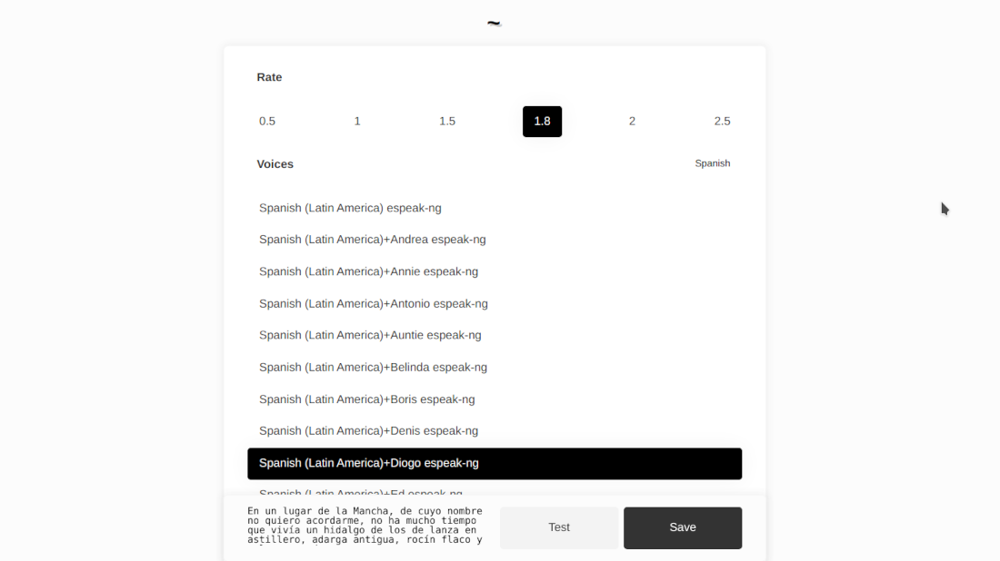
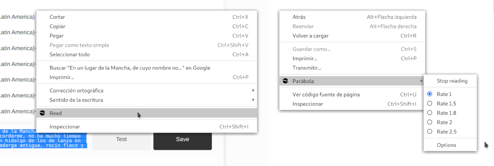

# Parábola

Read selected text in browser.

Firefox and Chromium based browser compatible extension

# Plugin configuration

# Submitting plugin

[Submitting an add-on](https://extensionworkshop.com/documentation/publish/submitting-an-add-on/)

[Publish in the Chrome Web Store](https://developer.chrome.com/docs/webstore/publish/)

# PC configuration 
...
